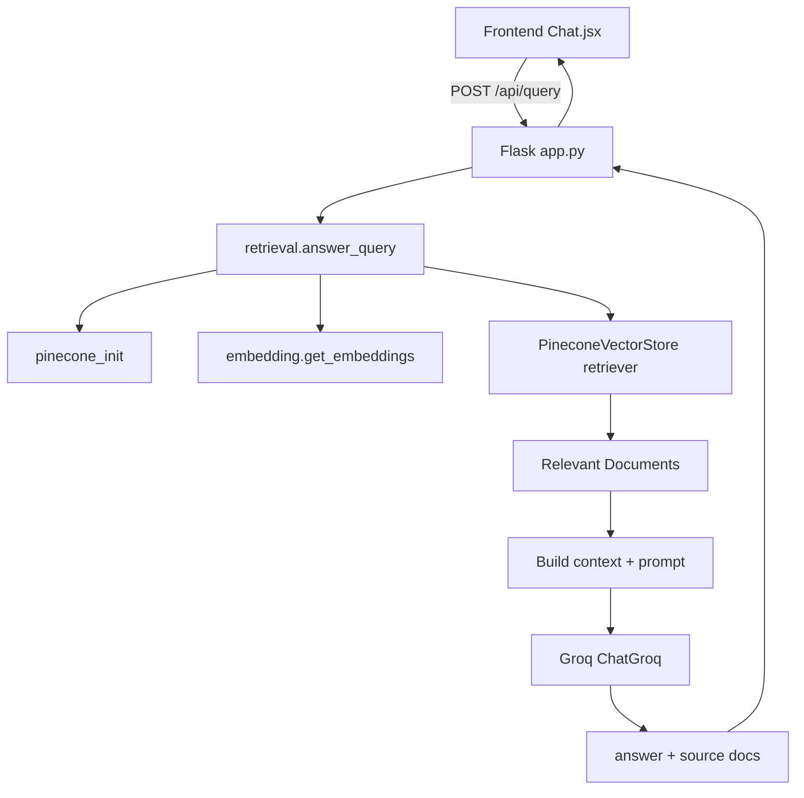

# FlashBackQA 後端架構與流程筆記

這份文件用來幫你把後端拆開看：每個檔案負責什麼、一次問答如何流動、哪些 function 真的在主流程上、哪些 code 比較像未接上的或可以重構。

## 1. 後端一句話概念

FlashBackQA 後端是一個 Flask RAG API：

使用者問題進來後，後端用 Hugging Face embedding 模型搭配 Pinecone 找相關回憶 chunk，再把 chunk 組進 prompt，交給 Groq LLM 產生回答。



## 2. 模組責任表

| 檔案 | 角色 | 是否在主流程 | 說明 |
|---|---|---:|---|
| `backend/app.py` | Flask API 入口 | 是 | 定義 `/api/query`、`/api/ingest`、`/api/suggestions`、`/api/health` |
| `backend/retrieval.py` | RAG 查詢主流程 | 是 | 負責向量檢索、prompt 組裝、Groq LLM 呼叫 |
| `backend/embedding.py` | embedding model 工廠 | 是 | 建立 `HuggingFaceEmbeddings` |
| `backend/pinecone_init.py` | Pinecone 初始化 | 是 | 讀 API key、建立/取得 index |
| `backend/ingest_docs.py` | Markdown 匯入流程 | 是 | parse front matter、切 chunk、embedding、upsert Pinecone |
| `backend/rerank.py` | reranker 模組 | 否 | 已寫好 CrossEncoder rerank，但目前沒有接進 `answer_query()` |
| `backend/data/*.md` | 原始回憶資料 | 間接 | `ingest_docs.py` CLI 會讀這些檔案 |

## 3. API 路由流程

### `POST /api/query`

位置：`backend/app.py`

用途：處理前端聊天問題。

流程：

1. `request.get_json()` 讀 JSON body。
2. 取出 `query` 與 `top_k`，預設 `top_k = 4`。
3. 如果沒有 query，回傳 400。
4. 呼叫 `answer_query(query_text, top_k)`。
5. 把 `answer` 與來源文件 `docs` 包成 JSON。
6. 發生例外時印 traceback，回傳 500。

輸入範例：

```json
{
  "query": "畢旅有什麼有趣的回憶？",
  "top_k": 4
}
```

輸出結構：

```json
{
  "answer": "LLM 產生的 Markdown 回答",
  "sources": [
    {
      "content": "被檢索到的 chunk",
      "metadata": {
        "title": "回憶標題",
        "people": ["人物"],
        "scenario": "場景"
      }
    }
  ]
}
```

### `POST /api/ingest`

位置：`backend/app.py`

用途：把前端或外部送進來的 Markdown blob 匯入 Pinecone。

流程：

1. 讀 JSON body。
2. 取出 `blob`。
3. 如果 blob 是空字串，回傳 400。
4. 呼叫 `ingest_blob(blob)`。
5. 回傳匯入結果。

### `GET /api/suggestions`

位置：`backend/app.py`

用途：產生前端快速提問按鈕。

流程：

1. 初始化 Pinecone index。
2. 建立一個 768 維 random vector。
3. 用 random vector 查 Pinecone，取回 metadata。
4. 從 `title`、`people`、`scenario` 組問題模板。
5. 不足 4 個時補上預設問題。

注意：這個做法可以快速拿到一些 metadata，但語意上不是「熱門問題」或「真正隨機抽樣」。如果之後要更穩定，建議改成維護 suggestions 表、讀固定 metadata 清單，或在 ingest 時產生建議問題。

### `GET /api/health`

位置：`backend/app.py`

用途：健康檢查。

目前只回傳：

```json
{ "status": "ok" }
```

## 4. 一次問答的詳細資料流

```txt
使用者輸入問題
  -> frontend/src/UI/page/Chat.jsx
  -> axios.post("http://localhost:5000/api/query", { query })
  -> backend/app.py query()
  -> retrieval.answer_query(query, top_k)
  -> pinecone_init.pinecone_init()
  -> embedding.get_embeddings()
  -> PineconeVectorStore(index, embedding)
  -> vectorstore.as_retriever(search_kwargs={"k": top_k})
  -> retriever.invoke(query)
  -> retrieved_docs
  -> 把 doc.metadata + doc.page_content 組成 context
  -> PROMPT.format(context=context, query=query)
  -> ChatGroq.invoke(full_prompt)
  -> answer
  -> Flask jsonify({ answer, sources })
  -> 前端 setMessages()
  -> MessageBoxMarkdown 顯示 Markdown
```

## 5. 重要 function 解釋

### `answer_query(query, top_k=4)`

位置：`backend/retrieval.py`

一句話：整個 RAG 查詢的主 function。

它做的事：

1. 初始化 Pinecone index。
2. 建立 embedding model。
3. 用 LangChain `PineconeVectorStore` 包裝 Pinecone。
4. 建立 retriever。
5. 檢查 `GROQ_API_KEY`。
6. 建立 Groq LLM client。
7. 用 retriever 找相關文件。
8. 把文件 metadata 和內容組成 `context`。
9. 把 `context` 與 `query` 填進 `PROMPT`。
10. 呼叫 LLM，回傳回答與來源文件。

輸入：

```python
answer_query("畢旅有什麼回憶？", top_k=4)
```

輸出：

```python
answer, retrieved_docs
```

重構觀察：

- 這個 function 同時做「初始化資源、查詢、組 prompt、呼叫 LLM、整理文件」，責任偏多。
- 可以拆成 `get_retriever()`、`retrieve_docs()`、`build_context()`、`generate_answer()`。
- 每次呼叫都建立 embeddings 與 LLM client，成本可能偏高；可考慮 lazy singleton。

### `get_embeddings()`

位置：`backend/embedding.py`

一句話：建立中文 embedding model。

重點語法：

```python
device = "cuda" if torch.cuda.is_available() else "cpu"
```

這行會檢查有沒有 GPU。有 GPU 就用 CUDA，沒有就用 CPU。

```python
HuggingFaceEmbeddings(
    model_name="shibing624/text2vec-base-chinese",
    model_kwargs={"device": device}
)
```

這會建立 LangChain 可使用的 embedding 物件，後面可以呼叫 `embed_documents()` 或交給 vector store 使用。

重構觀察：

- 可加 cache，避免每次 request 重新載入模型。
- 可以把模型名稱改成環境變數，例如 `EMBEDDING_MODEL`。

### `pinecone_init()`

位置：`backend/pinecone_init.py`

一句話：取得 Pinecone index，不存在時建立。

流程：

1. `load_dotenv()` 讀 `backend/.env`。
2. 從 `PINECONE_API_KEY` 建立 Pinecone client。
3. 設定 index 名稱 `flashbackqa`、維度 `768`、metric `cosine`。
4. 檢查 index 是否存在。
5. 不存在就建立 serverless index。
6. 回傳 `pc.Index(index_name)`。

重構觀察：

- index 名稱、維度、region 可以改成環境變數。
- `create_index` 與 `get_index` 可以拆開，避免正式服務啟動時意外建立資源。

### `ingest_blob(blob)`

位置：`backend/ingest_docs.py`

一句話：把 Markdown 多筆回憶轉成 Pinecone vectors。

流程：

1. `parse_multi_notes(blob)` 找出每段 front matter 與正文。
2. 初始化 Pinecone。
3. 初始化 embedding model。
4. 對每筆 note 讀 metadata。
5. `chunk_zh(body, 240, 60)` 切段。
6. `embed.embed_documents(chunks)` 產生向量。
7. 組成 Pinecone upsert 格式：

```python
{
    "id": "note_id#c000",
    "values": [0.1, 0.2, ...],
    "metadata": {
        "source": "note_id",
        "chunk_index": 0,
        "lang": "zh-TW",
        "text": "chunk content",
        "title": "title"
    }
}
```

8. `index.upsert(vectors=upsert_vectors)` 寫入 Pinecone。
9. 回傳 notes 數、upsert 數與 index stats。

重構觀察：

- `ingest_blob()` 很長，適合拆成 `build_metadata()`、`build_vector_id()`、`build_upsert_vectors()`。
- `parse_yaml_like()` 依賴 `pyyaml`，但 `typing` 與 parse error 處理可以更完整。
- 目前 metadata 直接塞 `people`、`keywords`，要確認 Pinecone SDK 接受的型別與查詢需求一致。

### `chunk_zh(text, target_len=240, overlap=60)`

位置：`backend/ingest_docs.py`

一句話：把中文長文切成多個有 overlap 的 chunk。

概念：

- 先用正規表達式把文字切成句子。
- 累積句子到接近 `target_len`。
- 超過長度就產生一個 chunk。
- 新 chunk 開頭保留上一個 chunk 的尾端 `overlap` 字，避免語意斷掉。

重構觀察：

- 目前分句 regex 因為編碼問題看起來不可靠。
- 可以改成更清楚的 regex，例如依 `。！？\n` 分句。

### `rerank_results(query, retrieved_docs)`

位置：`backend/rerank.py`

一句話：用 CrossEncoder 重新排序檢索結果。

流程：

1. lazy load reranker model。
2. 把每個 doc 轉成 `(query, doc["content"])` pair。
3. `model.predict(pairs)` 得分。
4. 把 score 塞回 doc。
5. 依 score 由高到低排序。

目前狀態：

- 這個 function 沒有接在 `answer_query()` 裡。
- 如果要使用，需要把 LangChain `Document` 轉成 `{"content": doc.page_content, "metadata": doc.metadata}` 之類的 dict，rerank 後再轉回或直接用 dict 建 context。

## 6. 主要語法概念

### Flask route decorator

```python
@app.route("/api/query", methods=["POST"])
def query():
    ...
```

`@app.route` 會把 URL 與 Python function 綁在一起。當 HTTP request 打到 `/api/query`，Flask 會執行 `query()`。

### JSON request / response

```python
data = request.get_json()
return jsonify(results), 200
```

`request.get_json()` 讀取前端送來的 JSON。`jsonify()` 把 Python dict 轉成 JSON response。

### Environment variables

```python
load_dotenv()
api_key = os.getenv("PINECONE_API_KEY")
```

`load_dotenv()` 會載入 `.env`，`os.getenv()` 從環境變數讀密鑰。密鑰不要寫死在 code。

### LangChain retriever

```python
vectorstore = PineconeVectorStore(index=index, embedding=embeddings)
retriever = vectorstore.as_retriever(search_kwargs={"k": top_k})
retrieved_docs = retriever.invoke(query)
```

這段把 Pinecone 包成 LangChain vector store，再建立 retriever。`k` 表示最多取回幾個相關文件。

### LLM invoke

```python
answer = llm.invoke(full_prompt).content
```

`invoke()` 會把 prompt 送到模型，回傳模型訊息物件。`.content` 是文字回答。

## 7. 哪些 code 目前看起來冗或難維護

### 1. 編碼壞掉的中文內容

多個檔案的註解、prompt、錯誤訊息、資料檔都出現 mojibake。這會造成：

- prompt 品質下降，LLM 可能收到壞掉的指令。
- metadata 變難讀，建議問題可能產生亂碼。
- 維護時很難判斷原意。

優先建議：先修復或重寫中文 prompt、錯誤訊息、`backend/data/*.md`。

### 2. `answer_query()` 責任太多

它同時做資源初始化、檢索、prompt 組裝與 LLM 呼叫。建議拆成：

```txt
get_index()
get_embedding_model()
retrieve_documents(query, top_k)
build_context(docs)
build_prompt(query, context)
generate_answer(prompt)
```

### 3. 模型與外部 client 重複初始化

`get_embeddings()` 在 API 啟動和每次 query/ingest 都可能被呼叫。embedding model 很重，建議做 lazy singleton。

### 4. `rerank.py` 尚未接入

如果 rerank 是要提升品質，應接進 retrieval flow；如果暫時不用，可以先移到 `experimental/` 或在文件註明未啟用。

### 5. `/api/suggestions` 用 random vector 查詢

這不是錯，但語意比較繞。更直覺的做法：

- ingest 時產生並保存 suggestions。
- 從固定 JSON 或資料庫讀建議問題。
- 用 metadata filter 或 query list 抽樣。

### 6. 設定值硬編碼

目前 index 名稱、維度、Groq model、Pinecone region 都在 code 裡。建議改成：

```env
PINECONE_INDEX_NAME=flashbackqa
PINECONE_DIMENSION=768
PINECONE_REGION=us-east-1
GROQ_MODEL=llama-3.3-70b-versatile
EMBEDDING_MODEL=shibing624/text2vec-base-chinese
```

## 8. 建議重構順序

1. 修復中文編碼與 prompt，先讓資料與指令可讀。
2. 確認 `python app.py` 能正常啟動，必要時修正語法錯誤。
3. 把 `retrieval.py` 拆成更小的 service/helper function。
4. 把 embedding、Pinecone、LLM client 做 lazy singleton。
5. 決定 `rerank.py` 要接入或移除。
6. 把前端 API base URL 改成 Vite env。
7. 補最小測試：health、query mock、ingest parser。

## 9. 一個比較乾淨的後端目標架構

```txt
backend/
├─ app.py                  # 只放 Flask route
├─ config.py               # 讀 env 與集中設定
├─ services/
│  ├─ rag_service.py        # answer_query 主流程
│  ├─ ingest_service.py     # ingest_blob 主流程
│  └─ suggestion_service.py # suggestions 主流程
├─ clients/
│  ├─ pinecone_client.py    # Pinecone 初始化/cache
│  ├─ embedding_client.py   # embedding model/cache
│  └─ groq_client.py        # LLM client/cache
├─ utils/
│  ├─ chunking.py
│  └─ metadata.py
└─ data/
```

這樣 route 只負責 HTTP，service 負責業務流程，client 負責外部服務，utils 負責純資料處理。之後要測試、替換模型或修 bug 都會簡單很多。
